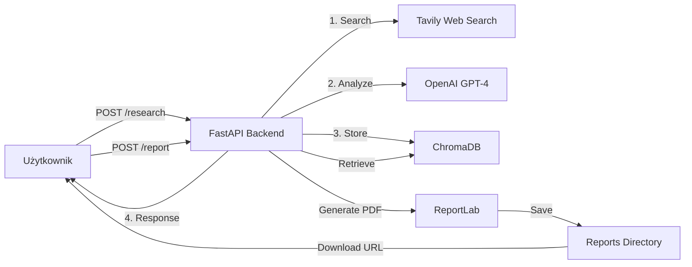

# 🧠 AI Research Agent

Inteligentny agent badawczy wykorzystujący Google Gemini 2.5 Flash, web search (Tavily), RAG (ChromaDB) i automatyczne generowanie raportów PDF.

## 📋 Spis treści

- [Funkcjonalności](#funkcjonalności)
- [Stack Technologiczny](#stack-technologiczny)
- [Struktura Projektu](#struktura-projektu)
- [Instalacja](#instalacja)
- [Konfiguracja](#konfiguracja)
- [Uruchomienie](#uruchomienie)
- [API Endpoints](#api-endpoints)
- [Przykłady Użycia](#przykłady-użycia)
- [Docker](#docker)

## ✨ Funkcjonalności

✅ **Web Research** - Automatyczne wyszukiwanie informacji w internecie (Tavily API)  
✅ **AI Analysis** - Analiza i przetwarzanie danych przez Google Gemini 2.0 Flash  
✅ **RAG System** - Przechowywanie wyników w bazie wektorowej (ChromaDB)  
✅ **PDF Reports** - Automatyczne generowanie profesjonalnych raportów PDF  
✅ **Research History** - Pełna historia przeprowadzonych badań  
✅ **RESTful API** - Nowoczesne API oparte na FastAPI  

### 🚀 Production Enhancements (NEW!)

✅ **Retry Logic** - Automatyczne ponowienie prób z exponential backoff (3 próby)  
✅ **Caching** - In-memory cache z 1-godzinnym TTL dla wyników wyszukiwania  
✅ **Advanced Logging** - RotatingFileHandler (10MB max, 5 backups)  
✅ **Error Handling** - Zaawansowana obsługa błędów z pełnym logowaniem  
✅ **Analysis Depth** - 5 poziomów głębokości analizy (od szybkiego przeglądu do deep dive)  
✅ **Response Validation** - Walidacja odpowiedzi z confidence scoring  

📖 **[Pełna dokumentacja production enhancements →](./PRODUCTION_ENHANCEMENTS.md)**  

## 🛠 Stack Technologiczny

| Technologia | Wersja | Przeznaczenie |
|------------|---------|---------------|
| **Python** | 3.11+ | Język programowania |
| **FastAPI** | 0.109.0 | Backend API framework |
| **Google Gemini** | 2.5 Flash | Inteligencja AI |
| **Tavily** | 0.3.0 | Web search engine |
| **ChromaDB** | 0.4.22 | Vector database (RAG) |
| **ReportLab** | 4.0.9 | Generowanie PDF |
| **Uvicorn** | 0.27.0 | ASGI server |
| **Pydantic** | 2.10.5 | Walidacja danych |
| **Tenacity** | 9.0.0 | Retry logic (NEW) |

## 📁 Struktura Projektu

```
Ai-Resercher-Agent-python/
├── backend/
│   ├── main.py                 # FastAPI application
│   └── src/
│       ├── models/
│       │   └── schemas.py      # Pydantic models
│       ├── services/
│       │   ├── agent.py        # Google Gemini Agent
│       │   ├── search.py       # Tavily Web Search
│       │   ├── vector_store.py # ChromaDB integration
│       │   └── pdf_generator.py # ReportLab PDF generation
│       └── utils/              # Utility functions
├── config/
│   └── settings.py             # App configuration
├── data/                       # ChromaDB data
├── reports/                    # Generated PDF reports
├── tests/                      # Unit tests
├── requirements.txt            # Python dependencies
├── .env.example               # Environment variables template
├── .gitignore
├── Dockerfile
├── docker-compose.yml
└── README.md
```

## 🚀 Instalacja

### 1. Klonowanie repozytorium

```bash
git clone <repository-url>
cd Ai-Resercher-Agent-python
```

### 2. Tworzenie środowiska wirtualnego

```powershell
# Windows PowerShell
python -m venv .venv
.\.venv\Scripts\Activate.ps1

# Lub cmd
.venv\Scripts\activate.bat
```

### 3. Instalacja zależności

```powershell
pip install --upgrade pip
pip install -r requirements.txt
```

## ⚙️ Konfiguracja

### 1. Utwórz plik `.env`

Skopiuj `.env.example` do `.env`:

```powershell
Copy-Item .env.example .env
```

### 2. Uzupełnij zmienne środowiskowe

Edytuj `.env` i dodaj swoje klucze API:

```env
# Google Gemini API Configuration
GEMINI_API_KEY=AIzaSy...your-gemini-api-key-here
GEMINI_MODEL=gemini-2.5-flash

# Tavily API Configuration
TAVILY_API_KEY=tvly-your-tavily-api-key-here

# Application Settings
APP_NAME=AI Research Agent
APP_VERSION=1.0.0
DEBUG=True
HOST=0.0.0.0
PORT=8000

# Database & Storage
CHROMA_DB_PATH=./data/chroma_db
REPORTS_PATH=./reports

# API Settings
MAX_RESEARCH_DEPTH=5
MAX_SEARCH_RESULTS=10
SEARCH_TIMEOUT=30
```

### Gdzie uzyskać klucze API?

- **OpenAI API**: https://platform.openai.com/api-keys
- **Tavily API**: https://tavily.com/ (darmowy plan: 1000 zapytań/miesiąc)

## 🏃 Uruchomienie

### Metoda 1: Bezpośrednio z Pythona

```powershell
# Z głównego katalogu projektu
python -m uvicorn backend.main:app --reload --host 0.0.0.0 --port 8000
```

### Metoda 2: Uruchomienie main.py

```powershell
python backend/main.py
```

### Metoda 3: Docker (opcjonalnie)

```powershell
docker-compose up --build
```

## 📡 API Endpoints

Aplikacja będzie dostępna pod: `http://localhost:8000`

### Główne Endpointy

| Metoda | Endpoint | Opis |
|--------|----------|------|
| `GET` | `/` | Strona główna API |
| `GET` | `/health` | Health check |
| `POST` | `/research` | Przeprowadź badanie |
| `POST` | `/report` | Wygeneruj raport PDF |
| `GET` | `/history` | Historia badań |
| `GET` | `/research/{id}` | Szczegóły badania |
| `GET` | `/download/{filename}` | Pobierz raport PDF |
| `GET` | `/search` | Wyszukaj podobne badania |
| `GET` | `/docs` | Interaktywna dokumentacja API |

## 💡 Przykłady Użycia

### 1. Przeprowadzenie badania

**Request:**
```bash
curl -X POST "http://localhost:8000/research" \
  -H "Content-Type: application/json" \
  -d '{
    "topic": "Latest developments in quantum computing",
    "depth": 3,
    "max_results": 10
  }'
```

**Response:**
```json
{
  "research_id": "res_abc123xyz",
  "topic": "Latest developments in quantum computing",
  "status": "completed",
  "summary": "Quantum computing has made significant progress...",
  "key_findings": [
    "IBM announced 1000-qubit quantum processor",
    "Google achieved quantum advantage in optimization problems",
    "New error correction methods show promise"
  ],
  "sources": [
    "https://example.com/quantum-news-1",
    "https://example.com/quantum-news-2"
  ],
  "created_at": "2025-11-16T12:00:00Z"
}
```

### 2. Generowanie raportu PDF

**Request:**
```bash
curl -X POST "http://localhost:8000/report" \
  -H "Content-Type: application/json" \
  -d '{
    "research_id": "res_abc123xyz",
    "format": "pdf",
    "include_sources": true
  }'
```

**Response:**
```json
{
  "report_id": "rpt_def456uvw",
  "research_id": "res_abc123xyz",
  "file_path": "./reports/report_rpt_def456uvw_20251116_120500.pdf",
  "download_url": "/download/report_rpt_def456uvw_20251116_120500.pdf",
  "created_at": "2025-11-16T12:05:00Z"
}
```

### 3. Pobranie historii badań

**Request:**
```bash
curl "http://localhost:8000/history?limit=5"
```

**Response:**
```json
{
  "count": 5,
  "limit": 5,
  "research": [
    {
      "research_id": "res_abc123xyz",
      "metadata": {
        "topic": "Quantum computing",
        "status": "completed",
        "created_at": "2025-11-16T12:00:00Z"
      }
    }
  ]
}
```

### 4. Interaktywna dokumentacja

Odwiedź: `http://localhost:8000/docs`

Swagger UI pozwala na:
- Przeglądanie wszystkich endpointów
- Testowanie API bezpośrednio z przeglądarki
- Sprawdzanie schematów request/response

## 🐳 Docker

### Budowanie i uruchomienie

```powershell
# Build image
docker-compose build

# Uruchom kontener
docker-compose up

# W tle
docker-compose up -d

# Stop
docker-compose down
```

### Dockerfile

Obraz Docker zawiera:
- Python 3.11-slim
- Wszystkie zależności z requirements.txt
- Automatyczne uruchomienie FastAPI
- Volume mounting dla data i reports

## 🧪 Testowanie

```powershell
# Uruchom testy
pytest

# Z coverage
pytest --cov=backend --cov-report=html

# Konkretny test
pytest tests/test_agent.py -v
```

## 📊 Workflow Działania



## 🔧 Rozwiązywanie Problemów

### Problem: ModuleNotFoundError

**Rozwiązanie:**
```powershell
# Upewnij się, że venv jest aktywne
.\.venv\Scripts\Activate.ps1

# Reinstalacja dependencies
pip install -r requirements.txt
```

### Problem: OpenAI API Error

**Rozwiązanie:**
- Sprawdź klucz API w `.env`
- Zweryfikuj czy masz środki na koncie OpenAI
- Sprawdź czy model `gpt-4-turbo-preview` jest dostępny dla Twojego konta

### Problem: Tavily API Limit

**Rozwiązanie:**
- Sprawdź pozostały limit na: https://app.tavily.com/
- W darmowym planie: 1000 zapytań/miesiąc
- Zmniejsz `max_results` w request

## 📈 Dalszy Rozwój

- [ ] Frontend w React/Vue
- [ ] Authentykacja użytkowników
- [ ] WebSocket dla real-time updates
- [ ] Export do innych formatów (DOCX, Markdown)
- [ ] Advanced RAG z re-ranking
- [ ] Multi-language support
- [ ] Caching wyników
- [ ] Rate limiting

## 📄 Licencja

MIT License

## 👨‍💻 Autor

AI Research Agent - Projekt demonstracyjny dla rekrutacji

---

**⭐ Jeśli projekt Ci się podoba, zostaw gwiazdkę!**
